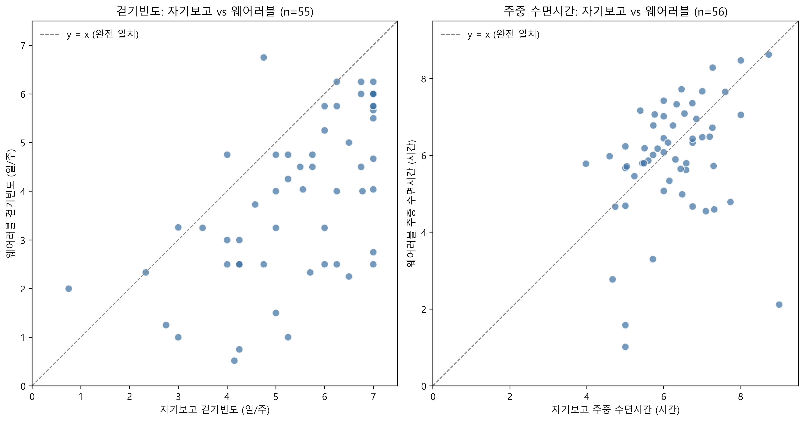
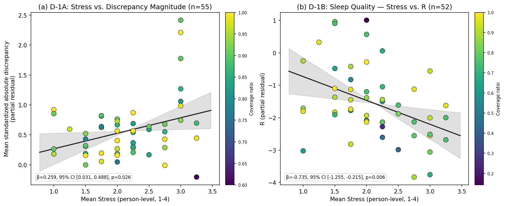
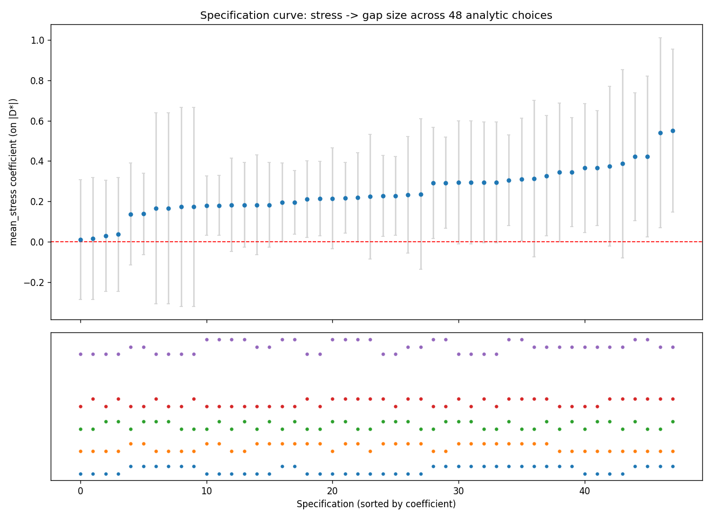

# 자기보고–웨어러블 간극과 스트레스: 분석 코드

삼성헬스(Samsung Health) 표본에서 자기보고와 웨어러블 측정치 간 일치도·간극과 지각된 스트레스의 관계를 분석하고, 독립적인 Fitbit 표본에서 같은 파이프라인을 적용해 외적 재현성을 점검한 분석 노트북입니다. 각 노트북의 셀 순서는 논문의 결과 절(Table/Figure 번호)과 대응하도록 구성되어 있습니다.

## 구성

```
.
├── samsunghealth/
│   ├── base_code.ipynb        # 삼성헬스 분석 (Table 1, 2, 4, 11–14, Figure 1–3 등)
│   ├── data/                  # 입력 데이터 (전처리 완료본)
│   └── results/               # 노트북이 생성하는 중간 결과·그림
├── Fitbit/
│   ├── base_code.ipynb        # Fitbit 외적 검증 (Table 10, 15–19 등)
│   ├── data/                  # 입력 데이터 (전처리 완료본)
│   └── results/               # 노트북이 생성하는 체크포인트 CSV
├── requirements.txt
└── README.md
```

## 실행 방법

1. Python 3.10 환경을 만들고 패키지를 설치합니다.
   ```bash
   pip install -r requirements.txt
   ```
2. **각 노트북은 자기 폴더를 작업 디렉터리로 하여** 실행합니다. 경로는 모두 상대경로(`data/`, `results/`)입니다.
   ```bash
   cd samsunghealth && jupyter notebook base_code.ipynb
   cd Fitbit        && jupyter notebook base_code.ipynb
   ```
3. 위에서부터 순서대로 실행합니다(Run All). 아래 단계는 앞 단계가 `results/`에 저장한 체크포인트 파일을 읽으므로 순서를 바꾸면 안 됩니다.

### 유의사항

- Fitbit 노트북은 9–10단계에서 `../samsunghealth/data/`를 읽어 삼성헬스 수면시간 지표를 재추정합니다. 두 폴더를 같은 위치에 두어야 합니다.
- 난수를 사용하는 셀(부트스트랩, 순열검정, 시뮬레이션)의 시드는 셀마다 고정되어 있습니다.
- 삼성헬스 노트북의 일부 셀(걷기 세션 임계값 민감도, 반복측정 ICC(1,1)/(1,4))은 원본 일별·세션 단위 자료가 필요해 이 저장소에서는 재현할 수 없으며, 코드는 문자열 주석(`r"""…"""`)으로 처리되어 실행되지 않습니다.
- 저장된 셀 출력 중 논문에 인용된 최종 결과 셀의 결과값은 논문 수치와 대조를 마쳤습니다. 중간 분석과 민감도 분석의 출력은 논문에 직접 보고되지 않은 결과를 포함합니다.

## 주요 결과

논문의 핵심 결과를 요약한 것이며, 세부 수치와 해석은 각 노트북의 해당 셀 출력에서 확인할 수 있습니다. 탐색적 분석의 $P$값은 다중검정 보정 전 값입니다.

### 삼성헬스 (`samsunghealth/base_code.ipynb`)

| 분석 | 결과 |
|---|---|
| 방법 간 일치도 (Table 11) | ICC가 네 지표 모두 0.50 미만 (걷기빈도 0.391, 걷기시간 0.102, 주중 수면 0.275, 주말 수면 0.224). 걷기빈도·주중·주말 수면시간은 순위상관·반복측정 관계가 FDR 보정 후에도 유의 |
| D-1A: 스트레스와 불일치 크기 | β = 0.259, 95% CI [0.031, 0.488], P = .026 |
| D-1B: 스트레스와 수면의 질 방향성 간극 | β = −0.735, 95% CI [−1.255, −0.215], P = .0056 (FDR P = .045) |
| 시간분리 예측 (Table 13) | 초기 스트레스 → 후기 간극 β = 0.260 (P = .003), 순열검정 P = .002 |



*Figure 1. 걷기빈도와 주중 수면시간의 자기보고–웨어러블 산점도 (점선은 완전 일치)*



*Figure 2. 스트레스와 측정방법 간 불일치의 관계 (a: D-1A 불일치 크기, b: D-1B 수면의 질 방향성 간극)*



*Figure 3. 스트레스–불일치 관계의 specification curve (48개 분석 사양)*

### Fitbit (`Fitbit/base_code.ipynb`)

| 분석 | 결과 |
|---|---|
| 방법 간 일치도 (Table 15) | 수면시간 ICC 0.394, Spearman ρ = 0.474 (삼성헬스와 유사하게 관련성은 있으나 절대일치도는 낮음) |
| 표준화 스트레스–간극 계수 (Table 16) | 참여자별 평균을 사용한 주 분석에서 D-1A (n = 26)는 β = 0.067 (P = .766), D-1B (n = 29)는 β = −0.465 (P = .227)였다. 두 계수는 삼성헬스와 같은 방향이었으나 통계적으로 유의하지 않았다 |
| 성분분해 (Table 17) | 자기보고 수면의 질 β = −0.465 (P = .016), 웨어러블 수면 점수 β ≈ 0.000 (P > .99) |
| 시간분리 예측 | 초기 디스트레스 β = −0.067 (P = .704), 삼성헬스 결과는 재현되지 않음 |
| within/between 보완분석 (Table 18) | 수면시간 within-person 효과는 β = 0.160 (P = .034)이었으나 삼성헬스와 방향이 달랐다. Daily mood 수준은 within-person에서, mood 변동성은 between-person에서 관련성이 관찰되었으며 Fitbit 전용 사후 보조분석으로 해석했다(P값은 다중검정 보정 전 값) |
| 강건성·검정력 (Table 19) | 부트스트랩 CI는 D-1A와 D-1B 모두 0을 포함했고, 검정력은 각각 8.9–13.8%, 5.8–7.7%로 낮았다 |

## 데이터

원본 설문과 웨어러블 일단위 기록의 전처리(설문–웨어러블 매칭, 응답일 직전 7일 창 집계 등)는 사전에 완료되어 있으며, 노트북은 다음 파일에서 시작합니다.

| 폴더 | 파일 | 내용 |
|---|---|---|
| `samsunghealth/data/` | `survey_final.csv` | 웨어러블 연동 58명의 참여자×주차 설문 분석 후보자료, 스트레스·CES-D 점수, 성별 (231행; 전체 설문 412건에서 구성) |
| | `wearable_person_week.csv` | 참여자×주차 웨어러블 파생 지표 (231행) |
| | `wearable_sleep_person.csv` | 참여자 단위 주중·주말 수면시간 간극과 분석 포함 플래그 (58행) |
| `Fitbit/data/` | `fitbit_survey_person_week.csv` | 참여자×주차 설문 응답 (386행, 42명) |
| | `fitbit_wearable_person_week.csv` | 참여자×주차 웨어러블 파생 지표 (386행) |
| | `fitbit_sleep_person_unionpooled.csv` | 참여자 단위 수면 지표(union-day pooling) |
| | `fitbit_daily_mood.csv` | 일별 기분(daily mood) 응답 (2,165건) |


## 검증 환경

Python 3.10, pandas 2.3, numpy 1.26, scipy 1.15, statsmodels 0.14, matplotlib 3.10, scikit-learn 1.7.

## 라이선스

분석 코드는 MIT License로 공개합니다.
포함된 연구 데이터가 있는 경우, 이는 소프트웨어 라이선스의 적용 대상이 아니며 해당 데이터의 이용 조건에 따라서만 사용할 수 있습니다.
